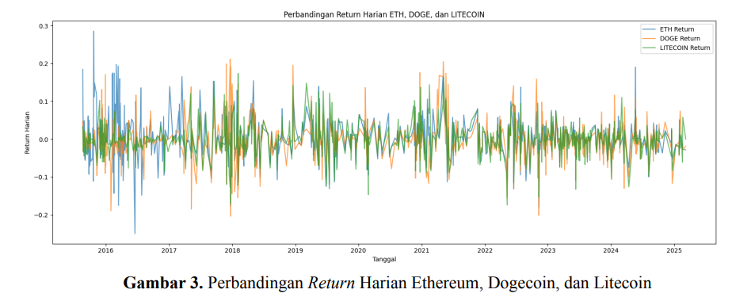
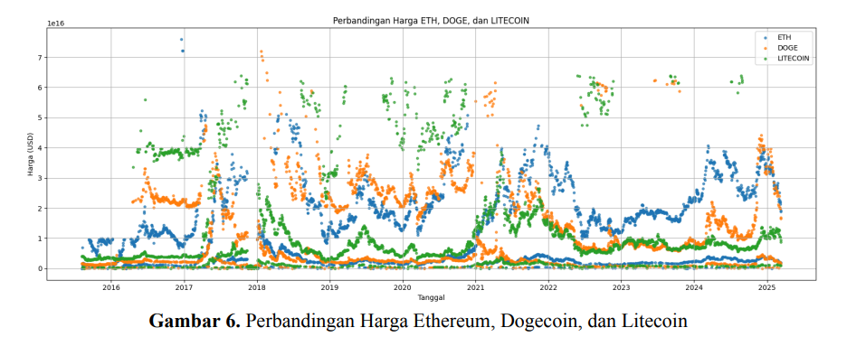
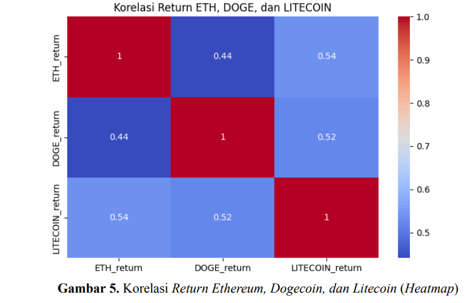

# Analisis Perbandingan Return Kripto: Ethereum, Dogecoin, dan Litecoin

[](https://colab.research.google.com/github/matwa-hub/big-data-crypto-clustering/blob/main/notebooks/825230133_Matius.ipynb)


---

## 📌 Deskripsi
Proyek ini menganalisis **return harian tiga kripto**:  
- **Ethereum (ETH)**  
- **Dogecoin (DOGE)**  
- **Litecoin (LTC)**  

Menggunakan dua algoritma clustering:  
- **K-Means Clustering**  
- **Fuzzy C-Means Clustering**

🎯 **Tujuan:** Membandingkan efektivitas kedua metode dalam mengelompokkan pola return kripto.  
📊 **Insight praktis:** Perbedaan metode clustering menghasilkan interpretasi cluster yang berbeda, penting bagi investor & analis pasar.

---

## 📊 Hasil Utama
| Metode              | Silhouette Score |
|---------------------|------------------|
| **K-Means**         | 0.6605 |
| **Fuzzy C-Means**   | 0.3786 |

📄 **Laporan lengkap tersedia di:** [`report/UAS_825230133_Matius.pdf`](report/UAS_825230133_Matius.pdf)

---

## 📂 Struktur Repository
data/ → Dataset harga kripto (Excel)
notebooks/ → Jupyter notebook analisis
report/ → Laporan PDF
results/ → Gambar hasil (visualisasi & plot)

---

## 💡 Skills Highlight
- Data Wrangling dengan **Pandas**
- Visualisasi dengan **Matplotlib & Seaborn**
- Clustering dengan **Scikit-Learn** & **Scikit-Fuzzy**
- Evaluasi model menggunakan **Silhouette Score**
- Reproducible workflow dengan **Jupyter Notebook**

---

## 📈 Visualisasi Hasil

### 🔹 Perbandingan Return Harian (ETH, DOGE, LTC)


### 🔹 Perbandingan Harga Kripto (ETH, DOGE, LTC)


### 🔹 Korelasi Return (Heatmap)


---

## 🚀 Cara Menjalankan Notebook
### 🔹 Opsi 1: Langsung di Google Colab
Klik badge “Open in Colab” di bagian atas README.

### 🔹 Opsi 2: Jalankan Lokal
1. **Clone repo:**
   ```bash
   git clone https://github.com/matwa-hub/big-data-crypto-clustering.git
   cd big-data-crypto-clustering
